# SDLC Fundamentals
## Module 15 | 1 Day | Sustain Engineering Training

---

## Agenda

| Session | Topics |
|---------|--------|
| **First Half (AM)** | SDLC Overview, Stages, Risk of Inadequate Testing, Famous Failures, Waterfall, V-Model, Spiral, Agile (Scrum, Kanban) |
| **Second Half (PM)** | Requirement Documents (SRS, BRD, FRD), STLC, Application Types, Dev/Test/Prod Environments |

> Understanding how software is built, tested, and delivered -- the lifecycle that sustain engineers support.

---

## What Is SDLC?

**Software Development Life Cycle (SDLC)** is a structured process for planning, creating, testing, deploying, and maintaining software applications.

### Why Sustain Engineers Must Understand SDLC
- You inherit code at **any stage** of its lifecycle
- Understanding the original development process helps you:
  - Find documentation and design decisions
  - Understand why code was written a certain way
  - Follow the correct process for making changes
  - Coordinate with QA, ops, and product teams

---

## SDLC Stages

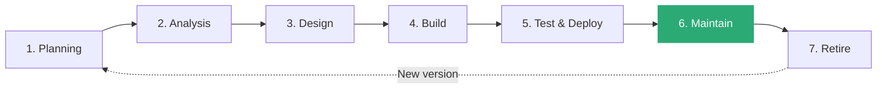

| Stage | Description | FoodExpress Example |
|-------|-------------|---------------------|
| **1. Planning** | Define goals, scope, timeline, budget | "Build a food delivery app for Bangalore" |
| **2. Analysis** | Gather requirements, feasibility study | Interview restaurants, customers, delivery partners |
| **3. Design** | Architecture, UI/UX, database design | Microservices architecture, React frontend |
| **4. Build** | Write code, develop features | Sprint-based development of order service |
| **5. Test & Deploy** | QA testing, staging, production release | Regression testing, blue-green deployment |
| **6. Maintain** | Bug fixes, updates, monitoring | **Sustain engineering!** |
| **7. Retire** | End-of-life, migration, decommission | Replace legacy order system |

---

## Stage 1: Planning

### Activities
- Define project vision and business objectives
- Identify stakeholders
- Estimate timeline and budget
- Risk assessment
- Resource allocation

### Key Outputs

| Document | Purpose |
|----------|---------|
| **Project Charter** | High-level scope, objectives, stakeholders |
| **Project Plan** | Timeline, milestones, resource plan |
| **Risk Register** | Identified risks with mitigation plans |
| **Budget Estimate** | Cost breakdown by phase |

---

## Stage 2: Requirements Analysis

### Types of Requirements

| Type | Description | FoodExpress Example |
|------|-------------|---------------------|
| **Functional** | What the system should DO | "User can search restaurants by cuisine" |
| **Non-Functional** | How the system should PERFORM | "Search results load in < 2 seconds" |
| **Business** | Why the system is needed | "Increase order volume by 30% in Q2" |
| **Technical** | Technical constraints | "Must run on AWS, Node.js backend" |
| **User** | End-user needs | "Customer can track delivery in real-time" |

### Requirements Gathering Techniques

| Technique | When to Use |
|-----------|-------------|
| **Interviews** | Complex requirements, subject matter expertise |
| **Surveys** | User preferences, feature prioritization |
| **Workshops** | Cross-functional requirements |
| **Prototyping** | UI/UX, unclear requirements |
| **Document Analysis** | Sustain: understanding legacy systems |
| **Observation** | Usability requirements |

---

## Requirement Documents

### BRD -- Business Requirements Document

| Section | Content | FoodExpress Example |
|---------|---------|---------------------|
| **Business Objectives** | Why this project exists | Expand to 3 new cities by Q3 |
| **Scope** | What is included/excluded | Order management, NOT delivery fleet management |
| **Stakeholders** | Who is involved | Product, Engineering, Ops, Restaurant Partners |
| **Success Criteria** | How to measure success | 10,000 daily orders, < 2% error rate |
| **Constraints** | Limitations | Budget: $500K, Timeline: 6 months |

### BRD vs SRS vs FRD

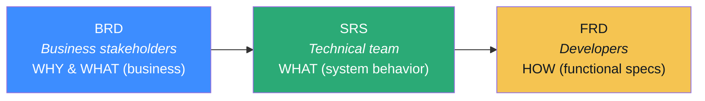

| Document | Audience | Detail Level | Focus |
|----------|----------|-------------|-------|
| **BRD** | Business stakeholders | High-level | WHY and WHAT (business) |
| **SRS** | Technical team | Detailed | WHAT (system behavior) |
| **FRD** | Developers | Very detailed | HOW (functional specs) |

---

## SRS -- Software Requirements Specification

### Structure

| Section | Content |
|---------|---------|
| **1. Introduction** | Purpose, scope, definitions |
| **2. Overall Description** | Product perspective, user characteristics, constraints |
| **3. Functional Requirements** | Detailed feature descriptions with inputs/outputs |
| **4. Non-Functional Requirements** | Performance, security, availability targets |
| **5. Interface Requirements** | UI, API, hardware, software interfaces |
| **6. Data Requirements** | Database schema, data flow, data retention |

### FoodExpress SRS Example (Excerpt)

```
FR-001: Place Order
  Description: Customer can place a food order from a restaurant
  Input: customer_id, restaurant_id, items[], payment_method
  Process:
    1. Validate customer and restaurant exist and are active
    2. Validate all items are available
    3. Calculate total (items + tax + delivery fee)
    4. Process payment
    5. Create order record
    6. Send confirmation notification
  Output: order_id, estimated_delivery_time
  Error Cases:
    - E1: Restaurant is closed -> Error 400
    - E2: Item out of stock -> Error 400
    - E3: Payment fails -> Error 402
```

---

## FRD -- Functional Requirements Document

### FoodExpress FRD Example

| Req ID | Feature | Description | Acceptance Criteria | Priority |
|--------|---------|-------------|---------------------|----------|
| FRD-001 | Restaurant Search | Search by name, cuisine, rating | Returns results in < 2s, supports pagination | P1 |
| FRD-002 | Menu Display | Show restaurant menu with prices | Grouped by category, shows availability | P1 |
| FRD-003 | Cart Management | Add/remove items, update quantities | Persists across sessions, max 20 items | P1 |
| FRD-004 | Order Placement | Submit order with payment | Atomic transaction, confirmation sent | P1 |
| FRD-005 | Order Tracking | Real-time delivery status | GPS tracking, ETA updates every 30s | P2 |
| FRD-006 | Order History | View past orders, re-order | Paginated, filterable by date/status | P2 |
| FRD-007 | Rating/Review | Rate restaurant and delivery | 1-5 stars, optional text, one per order | P3 |

---

## Risk of Inadequate Testing

> The cost of fixing a bug **increases 100x** when found in production vs during requirements.

### Cost of Defects by Phase

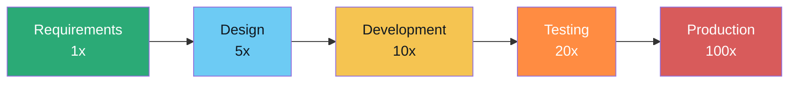

| Phase Found | Relative Cost | Example |
|-------------|---------------|---------|
| **Requirements** | 1x | Clarify a requirement in a meeting |
| **Design** | 5x | Redesign a component before coding |
| **Development** | 10x | Rewrite code that was built wrong |
| **Testing** | 20x | Fix bug, retest, delay release |
| **Production** | 100x | Emergency fix, customer impact, data loss |

### Consequences of Skipping Testing

| Risk | Impact | Real Example |
|------|--------|-------------|
| **Financial loss** | Revenue loss, penalties, lawsuits | Knight Capital: $440M in 45 minutes |
| **Security breaches** | Data theft, compliance violations | Equifax: 147M records exposed |
| **Safety hazards** | Injury or death | Therac-25: radiation overdoses killed patients |
| **Reputation damage** | Loss of customer trust | Healthcare.gov: public embarrassment |
| **Regulatory failure** | Fines, license revocation | Boeing 737 MAX: grounded worldwide |

---

## Famous Software Failures

### Case Study 1: Knight Capital (2012)
- **What:** Automated trading software deployed with old test code
- **Root Cause:** Dead code from 8 years ago was accidentally activated
- **Impact:** $440 MILLION lost in 45 minutes
- **Testing Gap:** No integration testing of deployment process
- **Lesson:** ALWAYS remove dead code. ALWAYS test deployments.

### Case Study 2: Healthcare.gov (2013)
- **What:** US health insurance marketplace website crashed at launch
- **Root Cause:** No load testing, 55 contractors with no integration
- **Impact:** Only 6 people enrolled on Day 1 (target: millions)
- **Lesson:** Test at PRODUCTION scale. Integrate early and often.

### Case Study 3: Therac-25 (1985-87)
- **What:** Radiation therapy machine gave massive overdoses
- **Root Cause:** Race condition in software, no hardware safety interlocks
- **Impact:** 6 patients received massive overdoses, 3 died
- **Lesson:** Software in safety-critical systems needs RIGOROUS testing.

### Case Study 4: Ariane 5 Rocket (1996)
- **What:** Rocket self-destructed 37 seconds after launch
- **Root Cause:** 64-bit float converted to 16-bit integer, causing overflow
- **Impact:** $370 million rocket destroyed
- **Lesson:** NEVER reuse code without re-validating in the new context.

---

## GROUP ACTIVITY: The Cost of a Bug (15 min)

### Scenario
FoodExpress has a bug: the **delivery fee calculation** is wrong. Instead of charging Rs 40 for orders under Rs 300, it charges Rs 0. This bug has been in production for **2 weeks**.

### Discuss in Your Group
- **Q1:** At which SDLC stage should this bug have been caught?
- **Q2:** What types of testing would have caught it?
- **Q3:** Estimate the financial impact (5,000 orders/day, 60% under Rs 300)
- **Q4:** What process changes would prevent this in the future?
- **Q5:** As a sustain engineer, what is your immediate action plan?

---

## SDLC Methodologies Overview

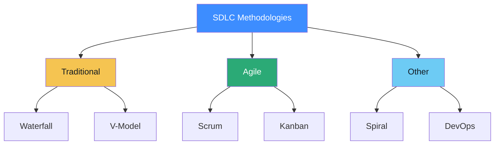

| Methodology | Approach | Feedback Loop | Best For |
|-------------|----------|---------------|----------|
| **Waterfall** | Sequential phases | End of project | Fixed requirements, regulated industries |
| **V-Model** | Verification & validation | Each phase paired | Safety-critical systems |
| **Spiral** | Risk-driven iterations | Each iteration | High-risk, complex projects |
| **Scrum** | Iterative sprints | Every 2-4 weeks | Evolving requirements, fast delivery |
| **Kanban** | Continuous flow | Continuous | Operations, sustain work, support |
| **DevOps** | Dev + Ops integration | Continuous | Rapid deployment, high reliability |

---

## Waterfall Model

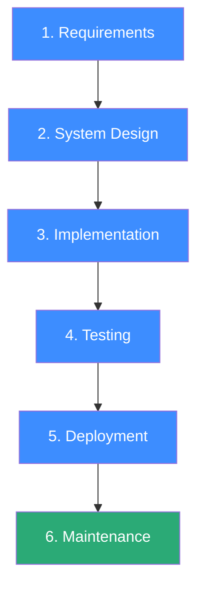

| Aspect | Description |
|--------|-------------|
| **Flow** | Linear, sequential -- each phase completes before next starts |
| **Requirements** | Must be fully defined upfront |
| **Changes** | Expensive and difficult after phase completion |
| **Documentation** | Heavy -- each phase produces documents |
| **Testing** | Happens after development is complete |
| **Delivery** | Single release at the end |

### When to Use
- Requirements are well-understood and unlikely to change
- Regulatory/compliance environments (medical, aviation)
- Short projects with fixed scope
- Contracts with fixed deliverables

---

## V-Model (Verification & Validation)

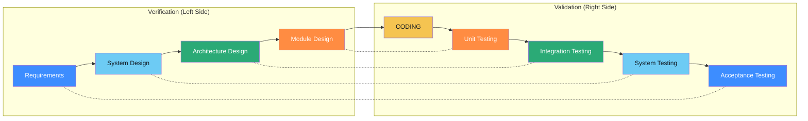

| Development Phase | Corresponding Test Phase | FoodExpress Example |
|-------------------|--------------------------|---------------------|
| **Requirements** | Acceptance Testing (UAT) | Customer can place order end-to-end |
| **System Design** | System Testing | Order service handles 1000 concurrent orders |
| **Architecture** | Integration Testing | Order service calls payment service correctly |
| **Module Design** | Unit Testing | calculateDeliveryFee() returns correct value |

### When to Use
- Safety-critical systems (medical devices, aviation, nuclear)
- Regulatory environments requiring traceability
- Requirements are stable and well-documented

---

## Spiral Model

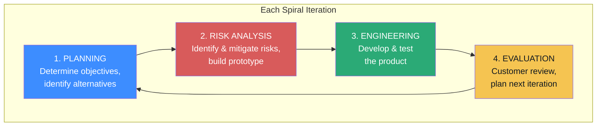

| Quadrant | Activity | FoodExpress Example |
|----------|----------|---------------------|
| **1. Planning** | Define objectives, identify alternatives | Iteration 1: Build ordering prototype |
| **2. Risk Analysis** | Identify and mitigate risks, build prototype | Risk: Payment integration may fail |
| **3. Engineering** | Develop and test the product | Build order + payment integration, test |
| **4. Evaluation** | Customer review, plan next iteration | Demo to stakeholders, gather feedback |

> Key Difference: Spiral is **risk-driven** (prototype to reduce risk), while Agile is **feature-driven** (deliver working features).

---

## Agile -- Scrum Framework

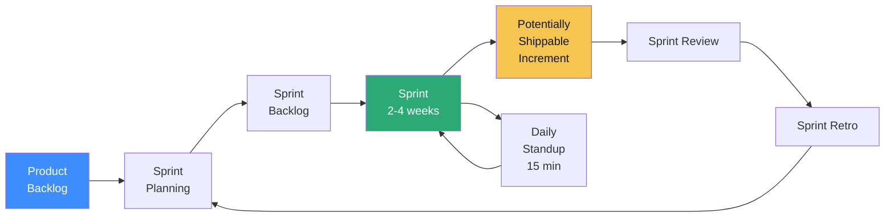

### Scrum Roles

| Role | Responsibility | FoodExpress Example |
|------|---------------|---------------------|
| **Product Owner** | Prioritizes backlog, defines acceptance criteria | Decides next features |
| **Scrum Master** | Facilitates process, removes blockers | Ensures sprint commitments |
| **Development Team** | Builds the product increment | Developers, testers (3-9 people) |

### Scrum Events

| Event | Duration | Purpose |
|-------|----------|---------|
| **Sprint Planning** | 2-4 hours | Select stories for the sprint |
| **Daily Standup** | 15 minutes | What did I do? What will I do? Any blockers? |
| **Sprint Review** | 1-2 hours | Demo completed work to stakeholders |
| **Sprint Retrospective** | 1-1.5 hours | What went well? What to improve? |

---

## Agile -- Scrum Artifacts

### Product Backlog Example

| Priority | Story | Points | Status |
|----------|-------|--------|--------|
| P1 | As a customer, I can search restaurants by cuisine | 5 | Done |
| P1 | As a customer, I can place an order | 8 | In Sprint |
| P2 | As a customer, I can track my delivery | 13 | Backlog |
| P2 | As a restaurant, I can update my menu | 5 | Backlog |
| P3 | As a customer, I can rate my order | 3 | Backlog |

### User Story Format

```
As a [role],
I want to [action],
So that [benefit].

Acceptance Criteria:
- Given [context], when [action], then [result]
```

### FoodExpress User Story Example

```
As a hungry customer,
I want to search restaurants by cuisine type,
So that I can quickly find what I want to eat.

Acceptance Criteria:
- Given I am on the search page, when I select "Indian",
  then I see only Indian restaurants
- Given search results load, they must appear within 2 seconds
```

---

## Agile -- Kanban

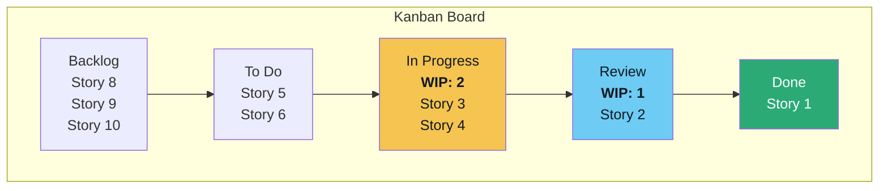

### Kanban Principles

| Principle | Description |
|-----------|-------------|
| **Visualize work** | Board shows all work items and their status |
| **Limit WIP** | Cap work-in-progress to prevent overload |
| **Manage flow** | Optimize for smooth, continuous delivery |
| **Make policies explicit** | Define "done", WIP limits, priority rules |
| **Continuous improvement** | Regularly review and optimize the process |

### Kanban vs Scrum

| Aspect | Scrum | Kanban |
|--------|-------|--------|
| **Cadence** | Fixed sprints (2-4 weeks) | Continuous flow |
| **Roles** | PO, SM, Dev Team | No prescribed roles |
| **Changes** | Avoid mid-sprint changes | Changes welcome anytime |
| **Best for** | Feature development | **Sustain, support, ops** |

---

## GROUP ACTIVITY: Pick the Right Methodology (10 min)

### For each scenario, choose: Waterfall, Scrum, Kanban, V-Model, or Spiral

| # | Scenario | Answer |
|---|----------|--------|
| 1 | Hospital pacemaker software. FDA regulated. Every feature must trace to a test. | **V-Model** |
| 2 | Startup social media app. Not sure what users want. Need to pivot quickly. | **Scrum** |
| 3 | Sustain team handles 20-30 bug tickets/week. Priorities change daily. | **Kanban** |
| 4 | Bank core system. $10M budget. Requirements unclear. Risk of failure very high. | **Spiral** |
| 5 | Government tax portal. 200-page spec. Fixed deadline. | **Waterfall** |

---

## DevOps

> DevOps is a **culture and set of practices** that brings Development and Operations together to deliver software faster, more reliably, and with higher quality.

### DevOps Infinity Loop

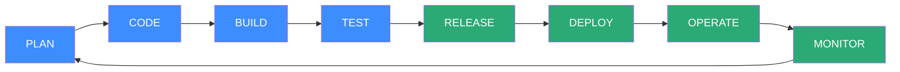

### DevOps Principles

| Principle | Description | FoodExpress Example |
|-----------|-------------|---------------------|
| **Culture** | Dev + Ops collaborate, shared responsibility | Developers on-call for their services |
| **Automation** | Automate everything repeatable | CI/CD pipeline, infrastructure as code |
| **Measurement** | Data-driven decisions | Deployment frequency, lead time, MTTR |
| **Sharing** | Share knowledge, tools, responsibilities | Shared runbooks, post-incident reviews |

---

## DevOps Practices & DORA Metrics

### Key Practices

| Practice | Description | FoodExpress Example |
|----------|-------------|---------------------|
| **CI** | Merge code frequently, auto-build and test | Every PR triggers build + unit tests |
| **CD** | Auto-deploy to staging/production | Merged code deploys to staging in 10 min |
| **IaC** | Infrastructure defined in code | Terraform for AWS resources |
| **Monitoring** | Observe system health continuously | Datadog dashboards, PagerDuty alerts |
| **Containerization** | Package apps in containers | Docker for all microservices |
| **Feature Flags** | Toggle features without deployment | Enable loyalty program for 10% of users |

### DORA Metrics

| Metric | Definition | Elite Level |
|--------|-----------|-------------|
| **Deployment Frequency** | How often you deploy | Multiple per day |
| **Lead Time** | Code commit to production | < 1 hour |
| **Change Failure Rate** | % of deployments causing failure | < 5% |
| **MTTR** | Time to recover from failure | < 1 hour |

---

## STLC -- Software Testing Life Cycle

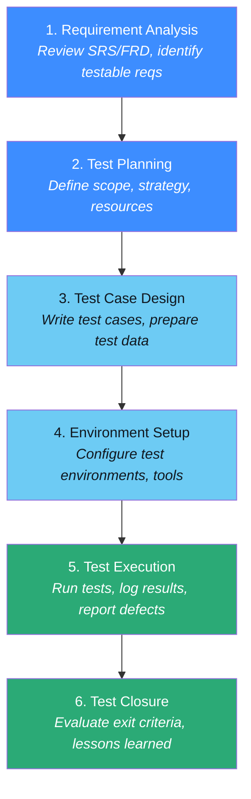

| Stage | Activities | Outputs |
|-------|-----------|---------|
| **Requirement Analysis** | Review SRS/FRD, identify testable requirements | Requirements Traceability Matrix (RTM) |
| **Test Planning** | Define scope, strategy, resources, schedule | Test Plan document |
| **Test Case Design** | Write test cases, prepare test data | Test cases, test scripts |
| **Environment Setup** | Configure test environments, tools | Ready test environment |
| **Test Execution** | Run tests, log results, report defects | Test results, defect reports |
| **Test Closure** | Evaluate exit criteria, lessons learned | Test summary report, metrics |

---

## Application Types

| Type | Description | FoodExpress Example |
|------|-------------|---------------------|
| **Web Application** | Browser-based, client-server | Customer-facing ordering website |
| **Mobile App** | Native or hybrid mobile | iOS/Android ordering app |
| **API/Microservice** | Backend service with API | Order Service, Restaurant Service |
| **Single Page App (SPA)** | Client-side rendered web app | React-based restaurant dashboard |
| **Desktop Application** | Installed on user's computer | Restaurant POS system |
| **Batch Application** | Scheduled processing | Nightly revenue report generation |
| **Real-time Application** | Live data processing | Delivery tracking, live chat |

### Architecture Patterns

| Pattern | Pros | Cons |
|---------|------|------|
| **Monolith** | Simple, easy to develop | Hard to scale, tight coupling |
| **Microservices** | Scalable, independent deployment | Complex, distributed systems |
| **Serverless** | No server management, auto-scale | Cold starts, vendor lock-in |
| **Event-Driven** | Loose coupling, scalable | Eventually consistent, debugging hard |

---

## Development Environments

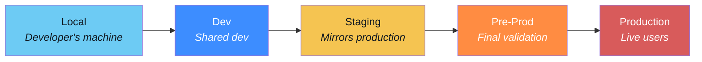

| Aspect | Local | Dev | Staging | Pre-Prod | Production |
|--------|-------|-----|---------|----------|------------|
| **Purpose** | Development | Integration | Testing | Final check | Live users |
| **Data** | Mock/seed | Synthetic | Subset of prod | Anonymized prod | Real data |
| **Users** | Developer | Dev team | QA team | Stakeholders | Everyone |
| **Infra** | Laptop | Shared server | Prod-like | Identical to prod | Full scale |
| **Deployment** | Manual | Auto (CI) | Auto (CD) | Manual gate | Approved only |

---

## Environment Management Best Practices

| Practice | Why | How |
|----------|-----|-----|
| **Parity** | Reduce "works on my machine" | Use containers, IaC to match environments |
| **Data isolation** | Prevent test data in production | Separate databases, never share |
| **Access control** | Limit who can change what | RBAC: devs deploy to dev, ops to prod |
| **Configuration** | Same code, different config per env | Environment variables, config files |
| **Promotion** | Code moves up, never down | Local -> Dev -> Staging -> Prod |

### Environment Variables Example

```javascript
// .env.development
DB_HOST=localhost
DB_NAME=foodexpress_dev
LOG_LEVEL=debug

// .env.production
DB_HOST=prod-db.internal
DB_NAME=foodexpress
LOG_LEVEL=warn
```

---

## INDIVIDUAL ACTIVITY: Write a User Story (15 min)

### Choose one FoodExpress feature:

| # | Feature | Hint |
|---|---------|------|
| A | **Promo Code** | Customer applies a discount code at checkout |
| B | **Reorder** | Customer reorders a previous order with one click |
| C | **Restaurant Hours** | System prevents orders when restaurant is closed |
| D | **Delivery Rating** | Customer rates delivery partner after order completion |

### Template

```
Title: [Short title]
Priority: P1 / P2 / P3

As a [role],
I want to [action],
So that [benefit].

Acceptance Criteria:
- Given [context], when [action], then [result]
- Given [context], when [action], then [result]
```

### Steps
1. **Step 1 (8 min):** Write your user story individually
2. **Step 2 (5 min):** Pair up and review -- is it testable? complete?
3. **Step 3 (2 min):** 2-3 volunteers share with the class

---

## SDLC in Sustain Engineering Context

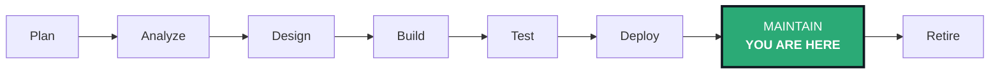

### Sustain Engineer's SDLC Activities

| SDLC Stage | Sustain Activity |
|------------|-----------------|
| **Planning** | Sprint planning for bug fixes and enhancements |
| **Analysis** | Read requirements docs to understand expected behavior |
| **Design** | Review architecture docs, understand dependencies |
| **Build** | Fix bugs, add small features, refactor |
| **Test** | Add regression tests, verify fixes |
| **Deploy** | Follow change management, deploy fixes |
| **Maintain** | Monitor, respond to incidents, performance tune |

### Sustain Anti-Patterns

| Anti-Pattern | Better Approach |
|-------------|-----------------|
| "Quick fix" without understanding | Read the code, understand the system |
| No documentation | Document every fix and its root cause |
| Skip testing | Add a test for every bug fix |
| Direct production fix | Always go through Dev -> Staging -> Prod |
| Ignore monitoring | Set up alerts, check dashboards daily |

---

## Change Management in Sustain

### Change Types

| Type | Description | Example | Approval |
|------|-------------|---------|----------|
| **Standard** | Pre-approved, low-risk | Config change, restart | No approval needed |
| **Normal** | Planned, moderate risk | Bug fix deployment | CAB approval |
| **Emergency** | Urgent, production impact | Critical security patch | Emergency CAB |

### Change Process

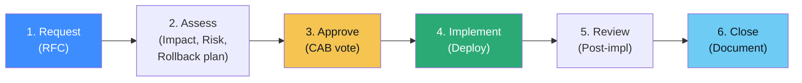

---

## Methodologies Comparison Summary

| Aspect | Waterfall | V-Model | Spiral | Scrum | Kanban | DevOps |
|--------|-----------|---------|--------|-------|--------|--------|
| **Approach** | Sequential | Sequential + test pairs | Risk iterations | Iterative sprints | Continuous flow | Continuous |
| **Planning** | Upfront | Upfront | Per iteration | Sprint-level | Just-in-time | Continuous |
| **Changes** | Difficult | Difficult | Per iteration | Between sprints | Anytime | Anytime |
| **Delivery** | End of project | End of project | Per iteration | End of sprint | Continuous | Continuous |
| **Best For** | Fixed scope | Safety-critical | High-risk | New features | **Sustain/ops** | High velocity |

---

## Key Takeaways

| Concept | Key Lesson |
|---------|-----------|
| SDLC Stages | Plan -> Analyze -> Design -> Build -> Test -> Deploy -> Maintain -> Retire |
| Testing Risk | Bug cost increases 100x from requirements to production |
| Waterfall | Sequential, heavy docs, fixed scope -- regulated environments |
| V-Model | Each dev phase paired with test phase -- safety-critical |
| Spiral | Risk-driven iterations with prototyping -- complex projects |
| Scrum | Iterative sprints, roles (PO, SM, Team), ceremonies |
| Kanban | Continuous flow, WIP limits -- ideal for sustain work |
| DevOps | Culture + automation + measurement; CI/CD, IaC |
| BRD/SRS/FRD | BRD = business why, SRS = system what, FRD = functional how |
| STLC | Parallel to SDLC: requirement analysis -> plan -> design -> execute -> close |
| Environments | Local -> Dev -> Staging -> Pre-Prod -> Prod |
| Sustain Context | You work in Maintain phase; follow change management, test everything |

> **Next: Module 16 -- Confluence & Jira**
