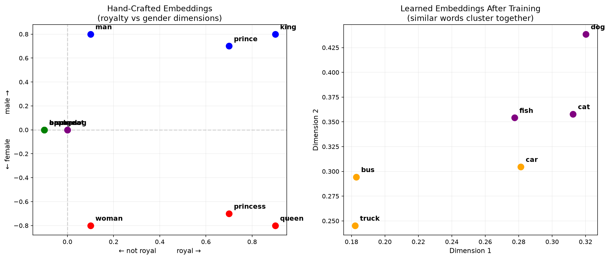

# Phase 1: The Engine
## How GenAI Works + Prompt Engineering + Build the UPI Service

**Theme:** HUMAN + AI Together
**Tool:** Claude Code
**Project:** UPI Transaction Service

---

## 1.1 How LLMs Work

Every AI tool you've used -- Copilot, ChatGPT, Claude -- runs on a Large Language Model. Try this in Claude Code:

```
Explain what happens inside a Large Language Model when I type this prompt.
Explain in exactly 5 steps. Use a simple diagram. Target audience: junior developers
who have USED AI tools like Copilot for 2 months but don't know how they work internally.
```

Here's what's happening under the hood:

```
Your Prompt
    |
    v
[1. Tokenizer]    Breaks text into tokens (~4 chars each)
    |
    v
[2. Embedding]    Converts tokens to numbers (vectors)
    |
    v
[3. Transformer]  Billions of parameters process the tokens
    |              Attention mechanism: "which words relate to which?"
    v
[4. Sampling]     Predicts the NEXT token from a probability distribution
    |              Temperature controls how random the choice is
    v
[5. Response]     Token by token, the response is generated
```

**Key insight:** An LLM does NOT "know" things. It predicts: *"given everything before this point, what token is most likely to come next?"* That's why it can be **confidently wrong**.

---

## 1.2 Live Tokenizer Demo

Try this in Claude Code:

```
Tokenize this sentence and show each token:
"POST /api/pay from rahul@ybl to priya@paytm amount Rs 500.00"

Show: each token, its token ID, and the total token count.
Then explain why "rahul@ybl" becomes multiple tokens.
```

Key takeaways:
- `"rahul@ybl"` = 4 tokens (not 1 word = 1 token)
- Punctuation, symbols (`@`, `/`, `.`) often become separate tokens
- Longer prompts = more tokens = more cost

---

## 1.3 Embeddings -- Words as Numbers

Run the embeddings demo (interactive -- press Enter to step through each stage):

```bash
python3 embeddings.py
```

This shows:
- Words become vectors (lists of numbers)
- Similar words cluster together in vector space
- You can do **math on meaning**: `king - man + woman = queen`



**Left plot:** Hand-crafted embeddings -- king/queen cluster near royalty, apple/banana near food
**Right plot:** Learned embeddings -- cat/dog/fish cluster, car/bus/truck cluster

This is Step 2 of the LLM pipeline. Every token gets converted to a vector like this before the Transformer processes it.

---

## 1.4 Key GenAI Terms

- **Token** -- ~4 characters per token. You pay per token.
  - `"rahul@ybl"` = 4 tokens

- **Context Window** -- How much text the model sees at once
  - 128K to 1M tokens
  - Paste 5000 log lines? It forgets the middle. Filter to 50.

- **Temperature** -- Controls randomness
  - `0` = same answer every time
  - `0.1` = use for code, payment logic
  - `0.7` = use for user-facing messages
  - `>1` = never in production

- **Hallucination** -- Confidently wrong
  - Ask NPCI settlement time -- says "30 min" (actually T+1)
  - Generates correct-looking SQL with wrong timezone

- **System Prompt** -- Hidden instructions that control AI behavior
  - `"You are a fintech engineer. Never generate DELETE queries."`

- **Fine-tuning** -- Train on YOUR data. Expensive, rarely needed.
  - Example: 50K UPI logs to auto-categorize failures

- **RAG** -- Feed your docs to AI at query time
  - Runbook library + AI = smart search at 3 AM

- **Agents** -- AI that reads files, runs code, calls APIs
  - Claude Code IS an agent -- it acts, not just responds

---

## 1.5 Prompt Engineering -- The R-C-T-F-C-E Framework

The difference between a useless AI response and a perfect one is the prompt.

### Bad Prompt (Level 1)

```
write upi payment code
```

Result: Generic, wrong language, wrong architecture, no context.

### Okay Prompt (Level 2)

```
Write a Node.js Express API for UPI payments with endpoints
for pay, refund, and check status. Use SQLite.
```

Result: Better -- right language, right DB. But missing validation, error handling, structure, test data.

### Great Prompt (Level 3) -- Build the UPI Service

Uses the R-C-T-F-C-E framework:

```
R -- Role        WHO is the AI?
C -- Context     WHAT's your tech stack? What exists already?
T -- Task        WHAT exactly do you want?
F -- Format      HOW should it respond? (files, structure, sections)
C -- Constraints WHAT should it NOT do?
E -- Examples    SHOW what good looks like
```

Without each element:

- No **Role** -- AI doesn't know Python vs Java vs Node
- No **Context** -- AI doesn't know your stack or existing code
- No **Task** -- AI gives everything OR nothing
- No **Format** -- AI dumps one giant file
- No **Constraints** -- AI adds auth, ORM, Docker you didn't ask for
- No **Examples** -- AI guesses your naming convention

### Mini-Challenge: Write Your Own Prompt

Before looking at the full prompt below, try writing your own prompt for:

> "Build a UPI Transaction Service with Express.js and SQLite"

Apply the R-C-T-F-C-E framework. Give yourself 2 minutes.

Then compare with the full prompt:

```
You are a senior Node.js backend engineer building a UPI Transaction Service.

CONTEXT:
- Tech stack: Node.js 18, Express.js, SQLite (file-based, no setup needed), EJS templates
- This is a MOCK service for training -- simulates UPI payment flows
- UPI transaction flow: Initiate -> Pending -> Processing -> Success/Failed
- VPA format: username@bankname (e.g., rahul@ybl, priya@paytm)

TASK:
Create a complete UPI Transaction Service with:

1. server.js -- Express app with these endpoints:
   - POST /api/pay          -- initiate a UPI transaction (payer_vpa, payee_vpa, amount, note)
   - GET  /api/txn/:txnId   -- check transaction status
   - POST /api/refund/:txnId -- initiate refund
   - GET  /api/balance/:vpa  -- check mock balance
   - GET  /                  -- dashboard showing recent transactions (EJS template)

2. db.js -- SQLite setup with tables:
   - transactions: txn_id, payer_vpa, payee_vpa, amount, note, status, created_at, updated_at
   - accounts: vpa, name, balance

3. public/dashboard.html -- Simple UI showing:
   - Form to initiate a payment
   - Recent transactions table with status badges
   - Balance checker

4. seed.js -- Seed script creating 5 test accounts with Rs 10,000 balance each:
   - rahul@ybl, priya@paytm, amit@okicici, sneha@axl, test@upi

CONSTRAINTS:
- Use better-sqlite3 (synchronous, no async complexity for demo)
- Validate VPA format (username@bankname)
- Validate amount (> 0, <= 100000, max 2 decimal places)
- Return proper HTTP status codes (201 for created, 400 for validation, 404 for not found)
- Add a random 2-second delay in POST /api/pay to simulate bank processing
- 80% transactions succeed, 20% randomly fail (simulates real UPI failure rate)
- Transaction ID format: TXN + timestamp + 4 random digits (e.g., TXN1695900000001234)

Create all files. Make it ready to run with: npm install && node seed.js && node server.js
```

Notice: The Level 3 prompt has Role, Context, Task, Format (numbered files), Constraints, and Examples (VPA format, TXN ID format). That's why it produces a complete, runnable app.

---

## 1.6 Advanced Prompting Techniques

- **Iterative Refinement** -- Build up in stages
  - `"Now add input validation to /api/pay"`
- **Self-Critique** -- Ask AI to review its own output
  - `"Review your code for bugs. Be harsh."`
- **Chain of Thought** -- Force step-by-step reasoning
  - `"Think through the refund logic step by step before coding"`
- **Negative Prompting** -- Specify what NOT to do
  - `"Do NOT use any ORM. Do NOT add auth yet."`
- **Few-Shot** -- Give examples of desired output
  - `"Example response: { status: 'success', txn_id: '...' }"`
- **Output Anchoring** -- Control the starting point
  - `"Start by creating package.json, then server.js"`
- **Persona Stacking** -- Combine multiple expertise
  - `"Review as both a security engineer AND a UPI domain expert"`

---

## 1.7 Self-Critique -- The Most Powerful Technique

After AI generates code, ask it to review itself:

```
Review all the code you just generated. List every bug, security issue,
and edge case you missed. Be harsh. Then fix the critical ones.
```

The pattern:

```
Step 1: AI generates code
Step 2: "Review your code. List every bug." --> AI finds 4-5 issues
Step 3: "Fix the critical ones." --> AI patches them
Step 4: YOU review what AI called "critical" -- do you agree?
```

**AI catches well:**
- Resource leaks, missing error handling
- Injection risks, broad exception catching

**AI misses:**
- Business rules (RBI 2FA for amounts > Rs 5000)
- Architecture decisions (distributed state)
- Domain knowledge (NPCI compliance)
- Organizational context (who to escalate to)

> **HUMAN + AI:** AI builds the 80%. You bring the domain knowledge for the last 20%.

---

## 1.8 Run It

```bash
npm install && node seed.js && node server.js
```

Open `http://localhost:3000`. Make a test payment.

A complete UPI payment service -- from nothing -- in minutes. Now let's enhance it step by step in Phase 2, touching every skill from the 44-day journey.

---

## Phase 1 Concepts

| # | Concept |
|---|---------|
| 1 | How LLMs work (5-step pipeline) |
| 2 | Tokenization (live demo) |
| 3 | Embeddings (vectors, similarity, visualization) |
| 4 | Key GenAI terms (token, context window, temperature, hallucination, system prompt, fine-tuning, RAG, agents) |
| 5 | Prompt Engineering (R-C-T-F-C-E, 3-level evolution) |
| 6 | Advanced prompting (7 techniques) |
| 7 | AI Code Review (self-critique pattern) |
| 8 | AI Agents |
